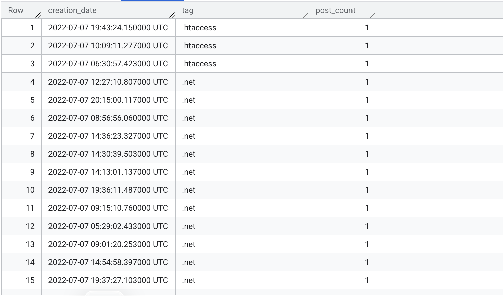
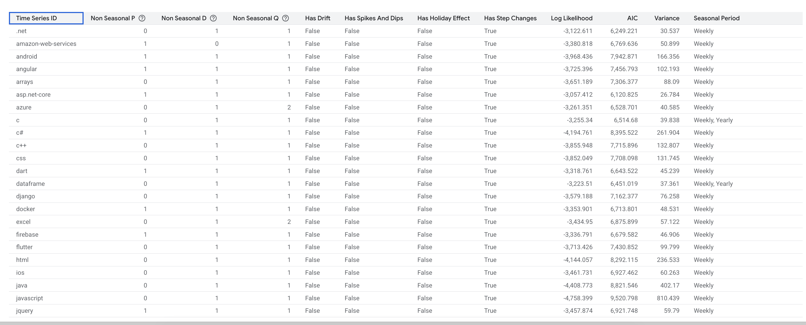
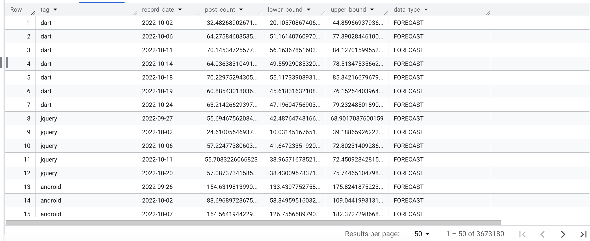
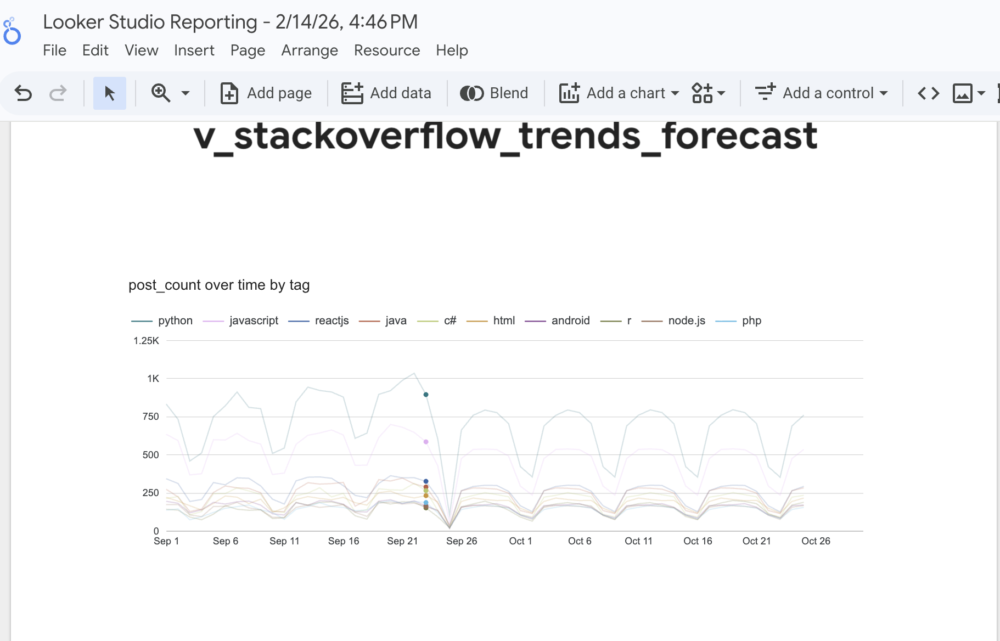

# 📈 Stack Overflow Tech Trends: 30-Day ML Forecast

An end-to-end data engineering and machine learning pipeline built in **Google BigQuery**. This project analyzes historical developer trends from 2020 to 2022 and uses the **ARIMA_PLUS** algorithm to predict the future popularity of the top 50 programming technologies.

---

## 🚀 Project Overview
The goal of this project is to provide data-driven insights into which technologies are rising or falling in developer interest. By leveraging the `bigquery-public-data.stackoverflow` dataset, the pipeline automates:
1.  **Data Extraction & Cleaning**: Aggregating millions of rows into a performant daily summary.
2.  **Time-Series Forecasting**: Training a multi-series ML model to predict future post volume.
3.  **Interactive Visualization**: A Looker Studio dashboard showing historical vs. predicted trends.

---

## ⚙️ Prerequisites
Before running the SQL scripts, ensure you have the following set up in your Google Cloud Console:
1.  **Google Cloud Project**: Create a project named `bigquery-pipeline-analytics` (or update the SQL scripts with your project ID).
2.  **BigQuery Dataset**: Create a dataset named `my_datasets` within your project.

---

## 🏗️ The Pipeline: Step-by-Step

### Step 1: Data Modeling & Optimization
We extract tags from the raw Stack Overflow posts and aggregate them by day. To ensure high performance and low query costs, the table is **Partitioned by Date** and **Clustered by Tag**.

```sql
-- See /sql/01_table_creation.sql for the full code
CREATE OR REPLACE TABLE `bigquery-pipeline-analytics.my_datasets.daily_tech_stats`
PARTITION BY DATE(creation_date)
CLUSTER BY tag AS ...
```


### Step 2: Training the Multi-Tag ML Model
Using BigQuery ML, we train an ARIMA_PLUS model. By using the TIME_SERIES_ID_COL='tag', the system automatically creates 50 individual sub-models—one for each technology (e.g., Python, Dart, Rust).

```sql
CREATE OR REPLACE MODEL `my_datasets.multi_tag_forecast`
OPTIONS(model_type='ARIMA_PLUS', ...) AS ...
```


### Step 3: Predictive Analytics View
We create a unified SQL View that joins historical "Actual" data with the "Forecasted" future data, including a 90% Confidence Interval (Upper and Lower bounds).



---

## 📊 Results & Visualization
The final output is an interactive Looker Studio dashboard.



### Key Findings:

- **Weekly Seasonality**: The model successfully identified that developer activity drops significantly on weekends.
- **Confidence Intervals**: The shaded areas in the forecast show the model's uncertainty, with higher volatility tags having wider bounds.

---

## 🛠️ How to Run
1. **BigQuery**: Run the scripts in the `/sql` folder in numerical order.
2. **Looker Studio**: Connect your BigQuery View `v_stackoverflow_trends_forecast` to a new report.
3. **Visualization**: Use `record_date` as the dimension and `post_count` as the metric.
